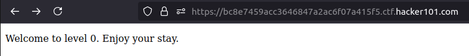
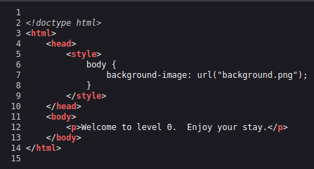

# A little something to get you started

The first page after the task is launched:

  

I decided to take a look at the source code of the site, where I found the `background.png` file:

  

I came to the conclusion that it is worth checking if I have access to this file, so I used the url https://bc8e7459acc3646847a2ac6f07a415f5.ctf.hacker101.com/background.png. This way I received the flag I was looking for.

## FLAG
^FLAG^d88cde79adaf7d786f4d70d32e856c9c2c3fcc0ad05c26e08212baa579a18611$FLAG$
